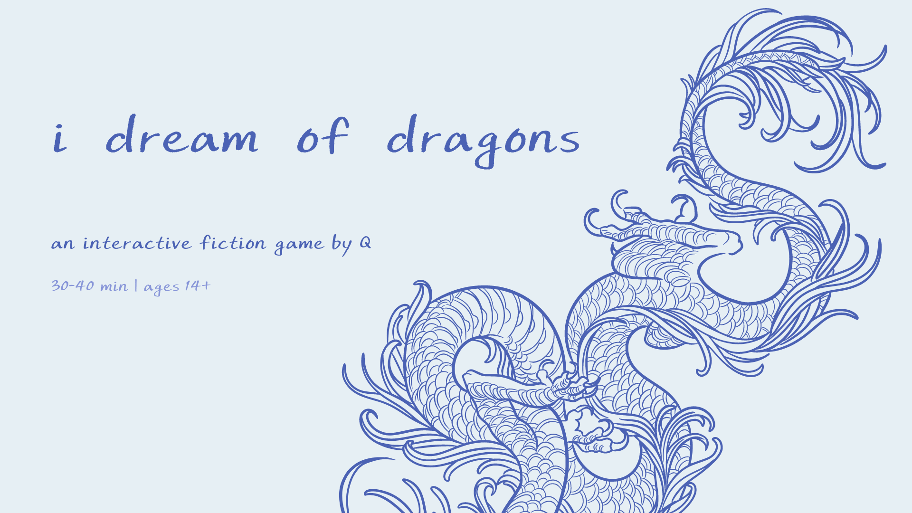
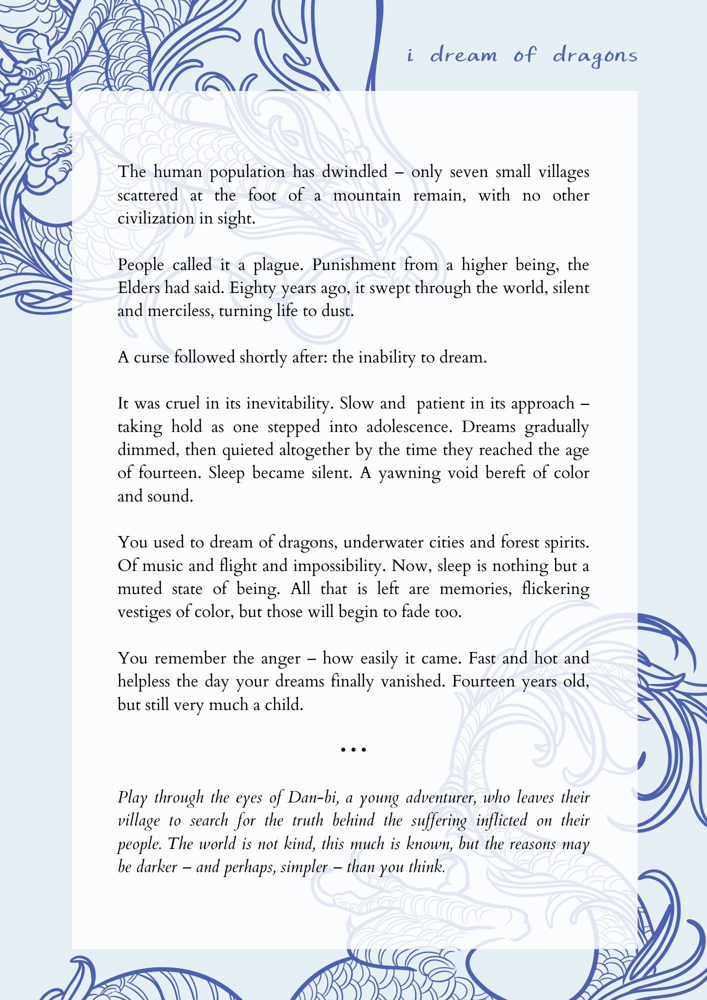

## "i dream of dragons"

an interactive fiction game by isabelle "Q" lee
### [play on itch.io](https://hyphenq.itch.io/i-dream-of-dragons)
  

  
### premise

  
  
## creative process details
this section contains spoilers. playing the game before reading is recommended!
   
### ideation
This idea came about from things I’ve been thinking about a lot, especially within the past two years. During quarantine, I rediscovered my love for fantasy and fiction through video games, and got knees-deep in fandom culture, fanfiction writing, and world-building. I spent a lot of time daydreaming, which was something I had not done freely since I was much younger. Subconsciously, I had internalized things that mentors, parents, and friends had either explicitly told me or implied  – that daydreaming, reading fantasy/fiction, and engaging in nerdy fandom culture was “childish”, “foolish”, and “a waste of my time”. 

When I do have them, my dreams and daydreams have always been (and still are) extremely vibrant, dystopian, fantastical and highly unrealistic. But as I grew older, I always attributed some form of guilt or shame to them, thinking that I was “too old” to be living in my imagination. At some point, I had internalized other people’s negative perceptions of dreaming and imagining fictional worlds so much that there was a period of time where I stopped dreaming altogether. 

I didn’t realize I was mourning this loss until I rediscovered that side of myself through video games, fantasy books, and animated films during quarantine, and I realized how foolish it was of me to lock away that part of me in the first place. So I decided to write a story about this process of growing up and losing a defining characteristic of my childhood, as well as the relief and beauty in its rediscovery. 
  
### terms + naming significance
I wanted to incorporate a bit of my own culture in terms of naming the characters. All character names, village names, and other game-unique terms are romanized versions of Korean words. 

Though the names of all the villages are not explicitly stated, each of the seven villages is named after one of the seven deadly sins. 

<table>
  <tr>
    <th>Village Name</th>
    <th>ENG</th>
    <th>KR</th>
    <th>Pronounciation</th>
  </tr>
  <tr>
    <td>Kyo-man</td>
    <td>Pride</td>
    <td>교만</td>
    <td>gyoman</td>
  </tr>
  <tr>
    <td>Na-teh</td>
    <td>Sloth</td>
    <td>나태</td>
    <td>natae</td>
  </tr>  
  <tr>
    <td>Seg-yok</td>
    <td>Lust</td>
    <td>색욕</td>
    <td>segyok</td>
  </tr>  
  <tr>
    <td>Sik-tam</td>
    <td>Gluttony</td>
    <td>식탐</td>
    <td>shiktam</td>
  </tr>
  <tr>
    <td>Bun-noh</td>
    <td>Wrath</td>
    <td>분노</td>
    <td>bunnoh</td>
  </tr>
  <tr>
    <td>Jil-tu</td>
    <td>Envy</td>
    <td>질투</td>
    <td>jiltu</td>
  </tr>
  <tr>
    <td>Tam-yok</td>
    <td>Greed</td>
    <td>탐욕</td>
    <td>tamyok</td>
  </tr>
</table>

Additionally, each character’s name is significant, and the meaning of their name is intended to complement the meaning of their assigned guardian’s name.
  
- Dan-bi (단비, pronounced *danbi*)
  - Role: Main character
  - Meaning: long awaited rain, spring rain, timely rain
  - 22 years old, gender neutral
  
- Ho-su (호수, pronounced *hosu*)
  - Role: Main character’s guardian
  - Meaning: lake
  - Appearance: Blue-white dragon in spirit form, elderly woman as one of their human forms
  - ?? years old, gender neutral

- Ja-yu (자유, pronounced *jayu*)
  - Role: One of the *San-ai* living in the forest from Ch. 1
  - Meaning: freedom
  - Appearance: Jade green eyes
  - 8-9 years old, female

- Bit-na (빛나, pronounced *bitna* but phonetically *bichna*)
  - Role: Catalyst for Dan-bi’s journey from Ch. 0
  - Meaning: shining
  - 14 years old, female

- Yi-sul (이슬, pronounced *eeseul*)
  - Role: One of the *San-ai* in Ch. 2
  - Meaning: dew
  - Appearance: lithe, golden-skinned young man
  - 20-22 years old, male

- An-ghe (안개, pronounced *angae*)
  - Role: Yi-sul’s guardian
  - Meaning: mist, fog
  - Appearance (not shown): a large phoenix-like bird
  - ?? years old, gender neutral

- San-ai (산 아이, pronounced *sanai*)
  - Term for the children who were born and raised in the mountain and whose parents left the seven villages 
  - Meaning: mountain child

